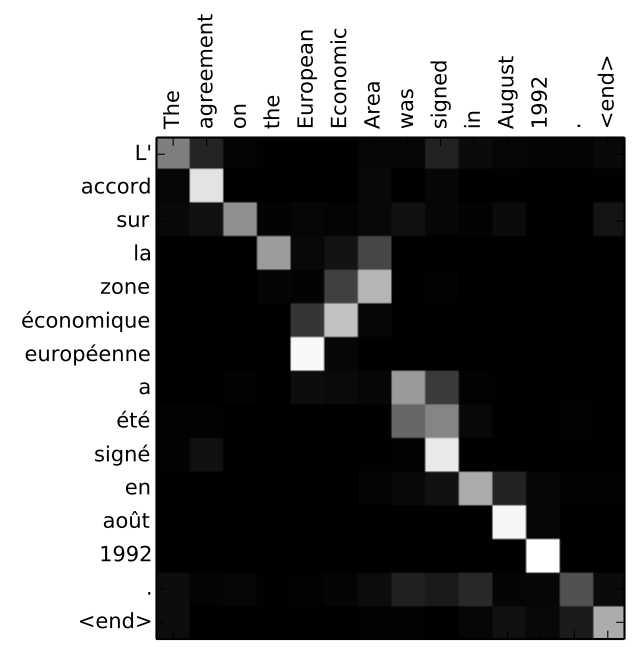

# Seq2seq

A model that takes a sequence of items (words, letters, features of images, etc) and outputs another sequence of items.

Eg: In translation, it would start by entering 'Soy', then 'un' and so on, once all the input is entered to the model, it will output 'I', then 'am' and so on.
```bash
Soy un estudiante -> Seq2seq translation model -> I am a student
```

Under the hood, the model is composed of an encoder and a decoder. So, the words enter the encoder, and it outputs a vector of floats called the context.

```bash
Soy un estudiante -> Encoder -> Context -> Decoder -> I am a student
```

Under the hood again, Encoder and Decoders are often RNNs, which process the information sequentially, in this case, word by word. So remembering RNNs, it takes as input the input vector(word embedding) and a hidden state(previous output). RNNs outputs the output and the hidden state. As the Encoder is an RNN, it processes each word at a time and the last hidden state is called the context.

```bash
(all words processed) -> Encoder -> Context (last hidden state)-> ...
```
To be more graphical and again under the hood of the decoder, there is a sequential process, where all cells are the same but in different step:

```bash
h_s: hidden state

[cell] -> (h_s 1) -> [cell] -> (h_s 2) -> [cell] -> (context) -> ...
  ^                     ^                   ^ 
 Soy                   un               estudiante
```
And in the decoder:

```bash
               I                 am
               ^                 ^
(context) -> [cell] -> (h_s 1) [cell] -> ...
```

The problem of this solution is the `context`, the decoder uses a `context` that summaries all the input, which works with short sentences but with larger ones, the vector couldn't hold so much information. So, the `context` was the bottleneck, the decoder didn't have more information that the `context`. So, to solve it, `Attention` emerged and instead of using a fixed and static `context`, it uses a dynamic one that changes at each step paying `attention` to the important information.

`Attention` differs from seq2seq in 2 ways:
1. The encoder passes all the hidden states to the decoder.
2. The decoder does an extra step to produce its output:
    - Use the hidden states from the decoder, there are 3 in the figure because there were 3 words in the input.
    - Give a score to each hidden state according to their relevance to the current hidden state of the decoder (purple block)
    - Apply softmax over the scores and multiply the result by the hidden states, to amplify the states with high scores and drown out the ones with low scores.
    - Sum the resulting vectors to get the context vector for this time step

So, as shown in the image, the 3 hidden states enter the decoder, and are processed to produce a new context vector, which is the responsible that the network can focus on different subset of encoder positions at each time step.


So, the way `attention` works with seq2seq is that the context vector is produced at each time step, in order to focus in different information. So it works in this sequence:
1. The attention decoder RNN takes the embedding of <END> token and an initial decoder hidden state (h_init).
2. The RNN cell produce the hidden state h4.
3. Attention step: use the encoder hidden states and h4 to produce the context vector C4.
4. Concatenate h4 and C4
5. Pass the vector through a neural network and its output is the word produced.
6. Repeat 1-5 for the next time steps.


To finish, the following image shows a matrix where the words in the rows are the inputs and the words in the columns are the outputs. The cells represent the encoder hidden states, so the whiter the cell, the more relevant is for each word input. For example, `The` aligns perfectly with `L'` as some other words, but in the case of `Area`, it pays attention to `la` and `zone`, which are words that are not aligned, this is because in French there are sentences written in the reversed order. The same happens with `European` and `Economic`, showing how powerful the model is.

